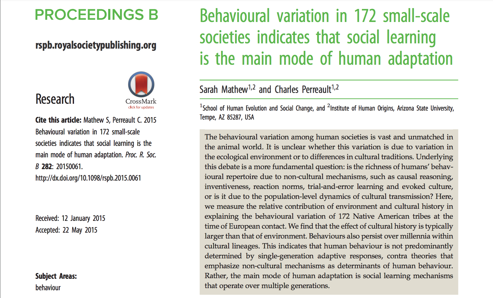
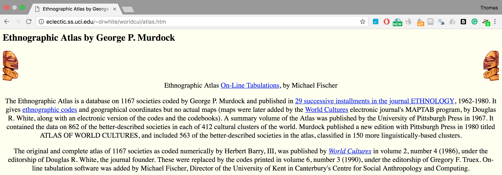
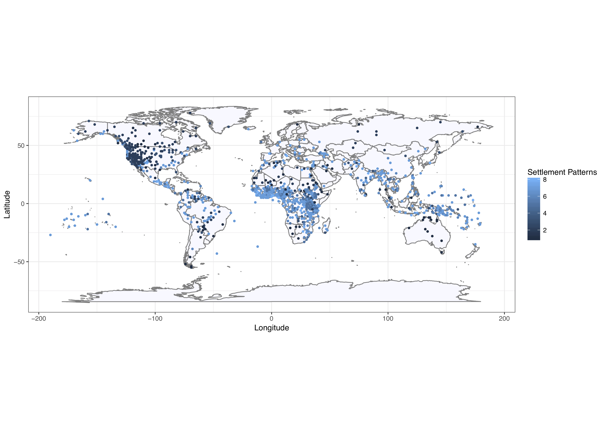
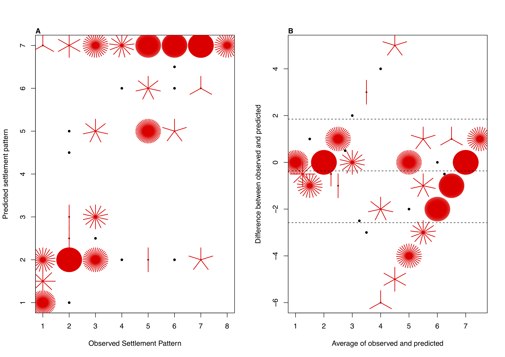
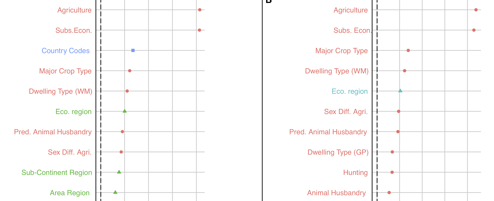
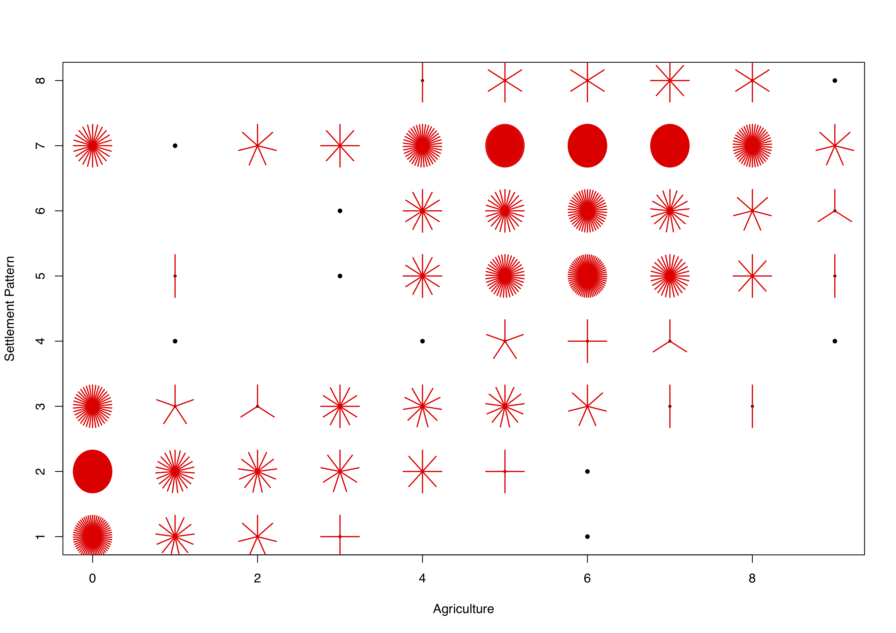
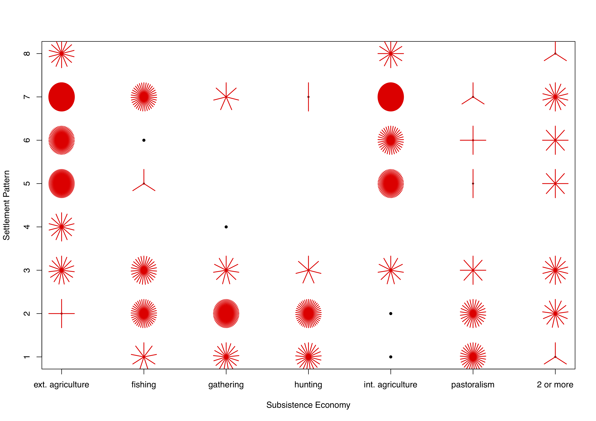
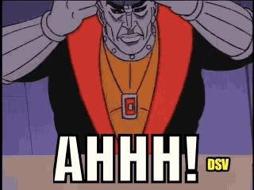
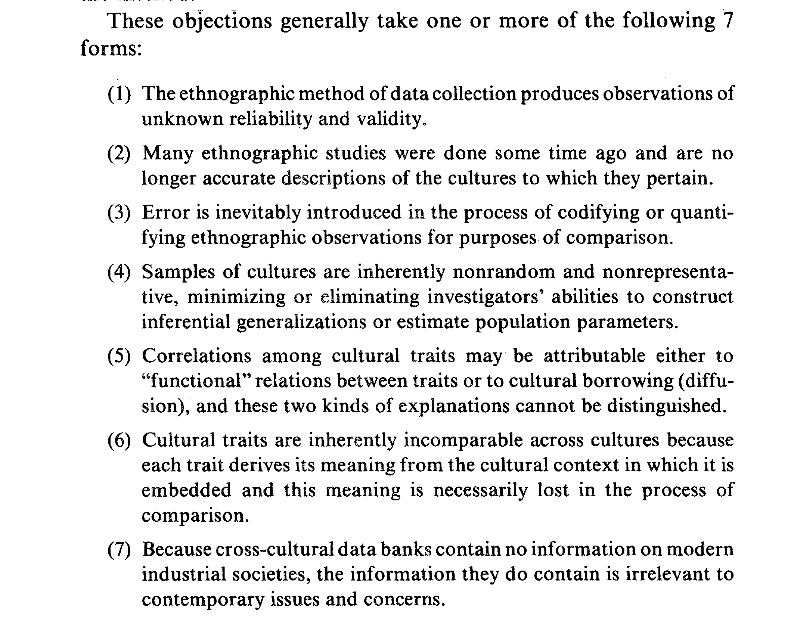

```{r setup, include=FALSE}
options(htmltools.dir.version = FALSE)
knitr::opts_chunk$set(echo = TRUE)
```
---
## The story behind this talk

* I was at [NIAS](www.nias.nl) working on machine learning applications.

--

* Mathijs van Dijk is a Professor in Finance. He wants to understand the functions of financial systems for society.

--

```{r, out.width = "600px", echo=FALSE, fig.align='center'}
knitr::include_graphics("modern-family.gif") 
```

---
## The importance of institutions for economic complexity.

* Institutional economists (e.g., Nobel Prize winner [Douglass North](https://en.wikipedia.org/wiki/Douglass_North)) stress the importance of institutions for economic development.

--

* Similar questions addressed in sociology (e.g., functionalism of Parsons (1951), Lenksi's Ecological-Evolutionary Theory (1974/2006)).

---
## Ongoing related debate in anthropology?

* The relative importance of culture versus ecology for behavioural variation. 

--

```{r, out.width = "600px", echo=FALSE, fig.align='center'}
 #  WNAI-D paper
``` 

---
## Research question

* Can we predict 'economic complexity' (or a proxy thereof).

--

* Relative importance of 'ecology' vs. 'culture'. (Which is potentially a misnomer).

--

* Macro-economists emphasize the importance of .


---
## Ethnographic atlas

```{r, out.width = "600px", echo=FALSE, fig.align='center'}
 
```

---
## Data cleaning

*  Technical variables (e.g., ID variable for the SCCS) were removed from the dataset. 

--

*  Some variables which were derived from other variables + some variables which proved to be problematic in a preliminary screening (for example due to a high percentage of missing cases or nominal variables with nearly unique codes).  

--

* Two variables in our preliminary analyses (_‘Mean_Size_of_Local_Communities’_ and _‘Jurisdictional_Hierarchy_Beyond_Local_Community’_) --> overlap to a large degree with our dependent variable. 

---
## Coding

* Broad categories: Culture / Ecology / none (e.g., Language class)

* Narrower categories.

* More narrow coding of cultural variables.

---
## Dependent Variable

* ‘settlement complexity’ (Settlement_Patterns). 

--

* Treated as an ordinal variable with 8 categories in the key analyses. Continuous for some figures. 

--

* “Fully migratory or nomadic bands / Separated hamlets where several such form a more or less permanent single community. / Neighborhoods of dispersed family homesteads / Seminomadic communities whose members wander in bands for at least half of the year but occupy a fixed settlement at some season or seasons, e.g., recurrently occupied winter quarters / Semisedentary communities whose members shift from one to another fixed settlement at different seasons or who occupy more  or less permanently a single settlement from which a substantial proportion of the population departs seasonally to occupy shifting camps, e.g., during transhumance. + Compact and relatively permanent settlements, i.e., nucleated villages or towns. / Compact but impermanent settlements, i.e., villages whose location is shifted every few years. / Complex settlements consisting of a nucleated village or town with outlying homesteads or satellite hamlets.”). 

---
## Method: Machine learning via 'ctree'.

Some key benefits:

--

* automatically detects interactions and non-linearities

--

* no overfitting (no pruning)

--

* BUT: trees are 'truly random'

---
## Ctree

"Conditional inference trees estimate a regression relationship by binary recursive partitioning in a conditional inference framework. Roughly, the algorithm works as follows: 

1) Test the global null hypothesis of independence between any of the input variables and the response (which may be multivariate as well). Stop if this hypothesis cannot be rejected. Otherwise select the input variable with strongest association to the response. This association is measured by a p-value corresponding to a test for the partial null hypothesis of a single input variable and the response. 

2) Implement a binary split in the selected input variable. 

3) Recursively repeate steps 1) and 2)."  Hothorn et al., 2014: 8

---
## (Conditional) Random Forests

* Build a large number of these trees!

--

* A commonly used tool for small N large P problems.

--

* Analyses suggest that these models are on a par or regularly outperform other machine learning methods (e.g., [Karuna et al. 2008](http://lowrank.net/nikos/pubs/empirical.pdf)). [Lay explanation](https://medium.com/rants-on-machine-learning/the-unreasonable-effectiveness-of-random-forests-f33c3ce28883)

---
## Variable importance

"More precisely, it measures the difference between the OOB error rate after and before permuting the values of the predictor of interest. ...  The idea underlying this VIM is the following: If the predictor is not associated with the response, the permutation of its values has no influence on the classification, and thus also no influence on the error rate. The error rate of the forest is not substantially affected by the permutation and the VI of the predictor takes a value close to zero, indicating no association between the predictor and the response. In contrast, if response and predictor are associated, the permutation of the predictor values destroys this association. **“Knocking out” this predictor by permuting its values results in a worse classification leading to an increased error rate.** The difference in error rates before and after randomly permuting the predictor thus takes a positive value reflecting the high importance of this predictor" Janitza et al. 2013, _BMC Bioinformatics_: p. 3

---
## Descriptives


```{r, out.width = "800px", echo=FALSE, fig.align='center'}
 
```

---
## Performance: Bland-Altman plot


```{r, out.width = "600px", echo=FALSE, fig.align='center'}
 
```

---
## Robustness checks

* Different starting seeds yield similar results.

--

* Varied 'varimp' and 'ntrees'.

-- 

* With and without 7 variables (country_Codes, Area_Region, SubContinent_Region, Continent, Language_Continent, Old_New_Class, Region)

---
## Results: Variable importance

```{r, out.width = "500px", echo=FALSE, fig.align='center'}
knitr::include_graphics("Figure3-panelled-19-5-edited.png") #Figure 3
```

---
## Results: A closer look (top 10).

```{r, out.width = "500px", echo=FALSE, fig.align='center'}
 #Figure 3
```

---
## What does it all mean?

* Forests are not really intepretable. Remains a black box. Some sample univariate trees --> note exploratory. (Alternatives are partial dependence plots)


---
## Results: Agriculture

```{r, out.width = "600px", echo=FALSE, fig.align='center'}
 
```
 
---
## Results: Subsistence economy

```{r, out.width = "600px", echo=FALSE, fig.align='center'}
 
```

---
## Conclusion

* Subsistence economy/agriculture best predictors. Unsurprising conclusion perhaps?

--

* Property rights and 'institutions' (or proxies thereof) have relatively little predictive influence.

--

* (Provided we can meaningfully disentangle). 'Ecology' is on a par with 'culture'

---
## Limitations

* Are agriculture/subsistence economy just the 'same thing' as settlement complexity?

* 'Garbage in, garbage out'. 

* Problems with modelling in these types of datasets (see [Towner et al., 2016](http://rspb.royalsocietypublishing.org/content/283/1826/20152184?ijkey=c5902d80f0e53946580d69674d101b1d17531f32&keytype2=tf_ipsecsha))

```{r, out.width = "400px", echo=FALSE, fig.align='center'}
 # source giphy.com
```


---
## Limitations

* Lots of issues with this type of research. Perhaps useful summary from Lee (1984: 523) _Journal of Family Issues_ 

--

```{r, out.width = "600px", echo=FALSE, fig.align='center'}
 
```

---
## Future work

* Machine learning challenge? How do other methods do (support vector machines)?

--

* A potential reanalysis of WNAI-D? Analysis of [Seshat](http://seshatdatabank.info/)?

--

* ['Qualitative Comparative Analysis'](https://cran.r-project.org/web/packages/QCA/QCA.pdf). (necessary and sufficient conditions for causal inference)

--

* Phylogenetic work (Mathijs van Dijk was working with Andrew Meade)

---
##Any Questions?

[http://tvpollet.github.io](http://tvpollet.github.io)

Twitter: @tvpollet

```{r, out.width = "600px", echo=FALSE, fig.align='center'}
knitr::include_graphics("https://media.giphy.com/media/3ohzdRoOp1FUYbtGDu/giphy.gif")
```

---
##Acknowledgments

* Funded by [NIAS](http://nias.knaw.nl) (and in past by [NWO](www.nwo.nl), [Templeton](www.templeton.org)).

* You for listening!

```{r, out.width = "500px", echo=FALSE, fig.align='center'}
knitr::include_graphics("https://media.giphy.com/media/10avZ0rqdGFyfu/giphy.gif")
```

---
## Why no cross-validation?

**The out-of-bag (oob) error estimate**:
"In random forests, there is no need for cross-validation or a separate test set to get an unbiased estimate of the test set error. It is estimated internally, during the run, as follows:

Each tree is constructed using a different bootstrap sample from the original data. About one-third of the cases are left out of the bootstrap sample and not used in the construction of the kth tree.

Put each case left out in the construction of the kth tree down the kth tree to get a classification. In this way, a test set classification is obtained for each case in about one-third of the trees. At the end of the run, take j to be the class that got most of the votes every time case n was oob. The proportion of times that j is not equal to the true class of n averaged over all cases is the oob error estimate. This has proven to be unbiased in many tests."
